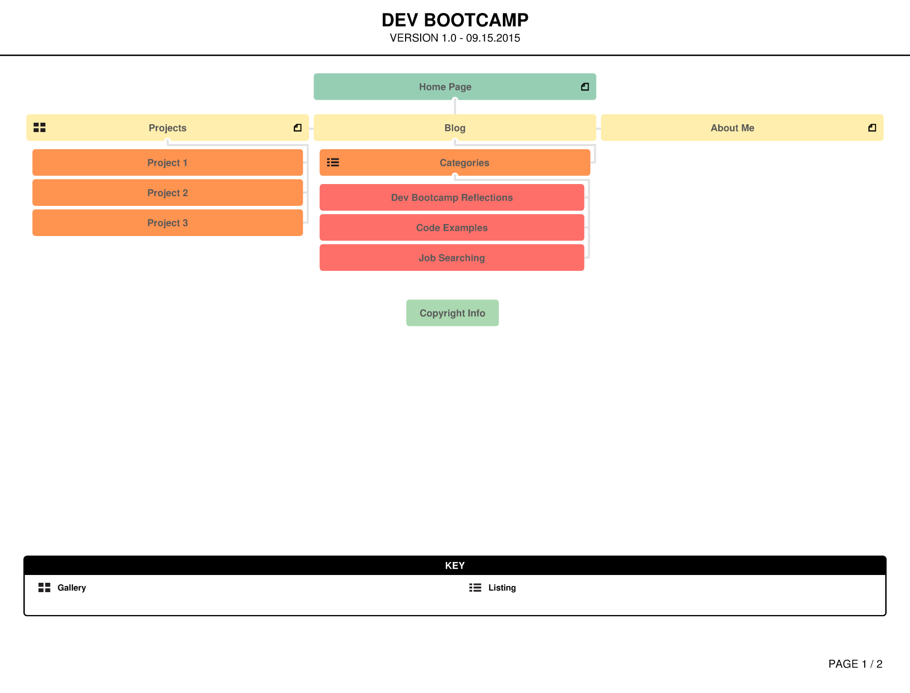

**1.  What are the 6 Phases of Web Design?**

1. Information Gathering
  * Who is the target audience?
  * What are they looking for in this website?
  * What sort of information should be included?
  This step may involve consulting surveys or user information for bigger projects.

2. Planning

  * Which pages should be included in the site?
  * What information should be on those pages?
  * How is the site going to be built?  Will I use a framework or a content management system?
  This phase may involve sketching or using online tools to create a sitemap, and researching design tools and methods.

3. Design

  During this stage, a designer might use wireframes and mockups to create the initial design.

4. Development

  During front-end development, the developer would build the site from a mockup using HTML, CSS, and JavaScript (if necessary).  Depending on the CMS and the purpose of the site, back-end development may also be necessary for collecting and storing data.

5. Testing and Delivery

  This stage involves testing the site on multiple browsers and operating systems, validating all the code, and allowing users to test it.  This is also the stage where a designer or team would test for speed and SEO.  Often a staging site will be used for testing before the final site is launched.  Once the site is ready for delivery, it can be launched via FTP.

6. Maintenance

  During this stage, a developer is reponsible for adding content, fixing bugs, and doing updates to keep the site up and running.

**2.  What is your site's primary goal or purpose?  What kind of content will your site feature?**

The primary goal of my site is to introduce myself to fellow Dev Bootcamp students.  It should include some personal information, a photograph, social media links, and blog posts.  Moving forward, I may also include content that is useful for future employers.

**3.  What is your target audience's interests and how do you see your site addressing them?**

At the moment, my target audience is current and prospective Dev Bootcamp students.  I plan on addressing their needs by making blog posts and contact information easily accessible.

**4.  What is the primary "action" the user should take when coming to your site?  Do you want them to search for information, contact you, or see your portfolio?  Its okay to have several actions at once, or different actions for different kinds of visitors.**

The primary "action" would be to read recent blog posts and comment, or be able to contact me.

**5.  What are the main things someone should know about design and user experience?**

First of all, design and user experience are closely related and shouldn't be separated.  It's pointless to have a site tht looks good, but doesn't take the user's needs into consideration.  A design doesn't have to be complicated, but it should depend on the target audience, the purpose, and the needs of the user.   Also, when designing a site, it's important to *iterate* the design, meaning to start with the very basic design of the whole site, then add complexity bit by bit.  For example, start with the wireframe, then add the layout, then add content, typography, colors, etc.

**6.  What is user experience design and why is it valuable?**

User Experience design involves studying the needs of the user and designing a site (or working with a designer) to create a site that takes their needs into consideration.  User experience identifies a target audience, conducts research, and uses design principles to help a user to have the best experience as possible with a website or application.

**7.  What parts of the challenge did you find tedious?**

With a small project like this one, it *does* seem tedious to go through all the steps of web mapping, identifying an audience, etc.  It's not something I would think to do on my own, but I do see how it's valuable experience to start thinking like a professional and going through the same workflow I would use for a bigger project.
