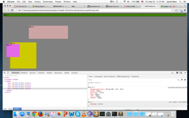

1.  

2.  

3.

4.

5.

6.

7.

8.

9.

**How can you use Chrome's DevTools inspector to help you format or position elements?**

The Chrome Inspector allows you to toggle existing CSS rules, add new rules, and preview any changes you make before you add the changes to your own CSS file.  It's especially helpful for positioning elements, as it allows you to see any changes you make in real time and use some trial-and-error to put the elements where you want.

**How can you resize elements in the DOM using CSS?**

You can resize elements by specifying a height and a width.  (This works for elements that don't have a position: inline).  The height and the width are most commonly specified in pixels, ems, and percentages.  Keep in mind that the size is also affected by the amount of padding inside the element.  

**What are the differences between Absolute, Fixed, Static, and Relative positioning? Which did you find easiest to use?  Which was most difficult?**

Objects with **absolute positioning** are not affected by other object on the page.They can overlap other objects, and move freely on the page by specifying top, bottom, left, and right values, which are relative to the edges of the container.  

An object with **fixed positioning** stays fixed in one place, even when the browser window scrolls.  

Objects by are, by default, given **static positioning**, which means they flow normally in the document.

Object with **relative positioning** can be positioned relative to their default position.  By specifying top, bottom, left, and right values, you can move an object with relative positioning around on the page relative to its original location.  

**What are the differences between Margin, Border, and Padding?**

Margin is the empty space around an object, outside its border, while padding is the empty space inside the border of an object.  In some cases, they can be used interchangably, but in other cases, such as when you have an object with a clearly defined border, you must pay attention to whether the space is outside or inside the border.

**What was your impression of this challenge overall? (love, hate, and why?)**

I enjoyed this challenge, and found it to be helpful.  CSS positioning has always been one of the harderst concepts to understand, and I don't think I ever fully understood the difference between static and relative position before this challenge.  

