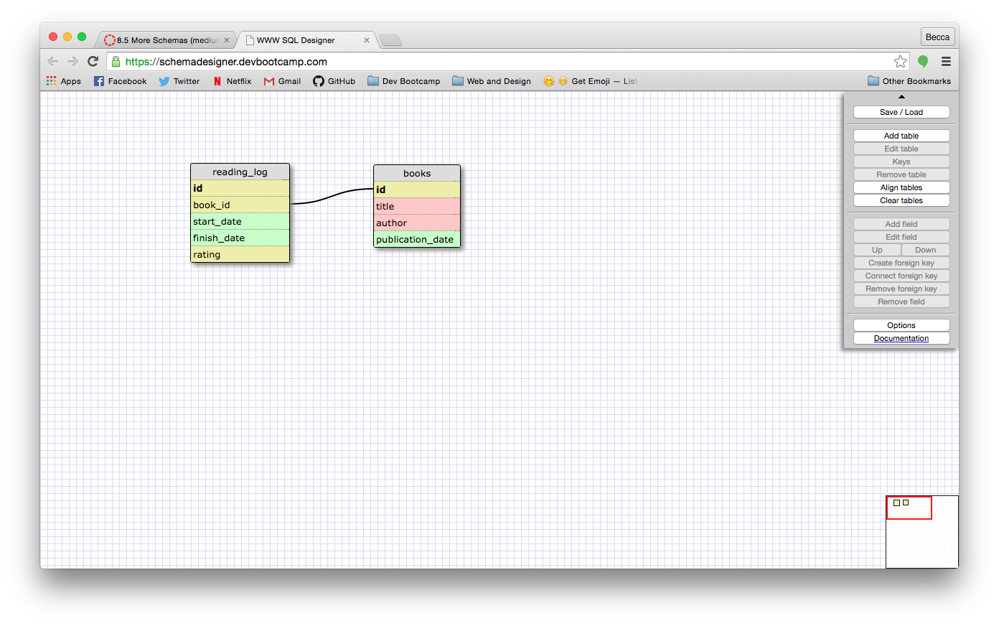
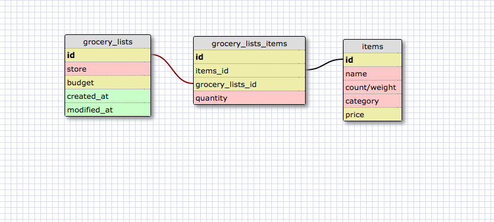

##8.5 More Schemas

Assuming that each reading record points to only one book, a reading log would be a one-to-one relationship.  Note that if this reading log contained data for more than one person, it's possible that it could become a one-to-many relationship, with multiple people reading the same book.

###What is a one-to-one database?

In a one-to-one database, one item is associated with one item in another table, which is also only associated with the one item.  For example, if I made a table of my belongings, each ID would be linked with one item, and each item would only be linked to me (unless there is shared ownership).  

###When would you use a one-to-one database? (Think generally, not in terms of the example you created).

You would use a one-to-one database in a situation where there is not a list of items that would be repeated multiple times in another table.  Each item is used one time in the databse.

###What is a many-to-many database?

A many-to-many database is a database which contains multiple lists of data which are connected to each other.  For example, you could have a list of restaurants and a list of menu items.  There are many restuarants and many items, and multiple restaurants could serve the same menu items.  

###When would you use a many-to-many database? (Think generally, not in terms of the example you created).

In general, you use a many-to-many database when you are dealing with multiple lists of information that are linked to each other.

###What is confusing about database schemas? What makes sense?

I'm still figuring out when to use multiple tables, and when everything needs to be in the same table.  In the grocery lists schema, it was rather confusing that the actual list was on the join table, and the grocery_lists table only had general information about the lists.  I think it would help me to see the information visualized in actual table form with examples.