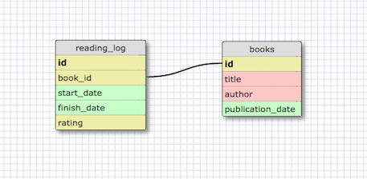

Assuming that each reading record points to only one book, a reading log would be a one-to-one relationship.  Note that if this reading log contained data for more than one person, it's possible that it could become a one-to-many relationship, with multiple people reading the same book.

